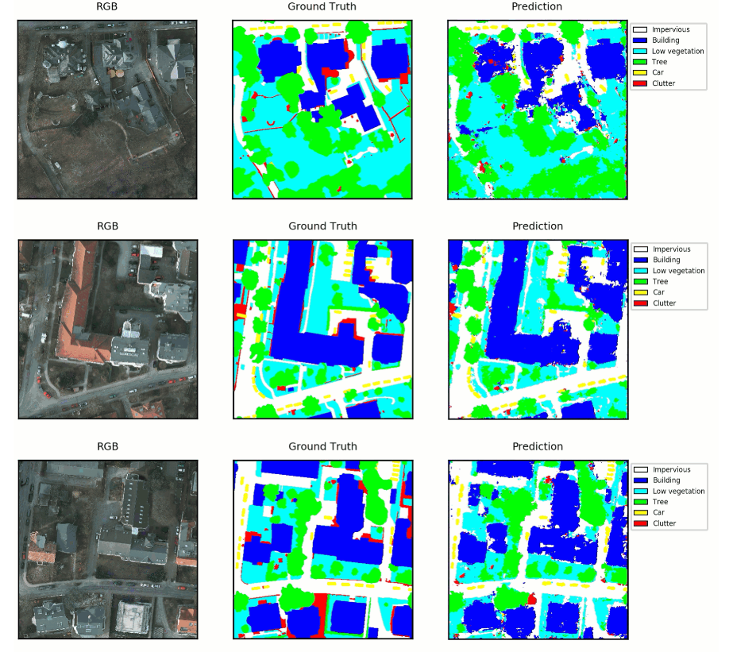
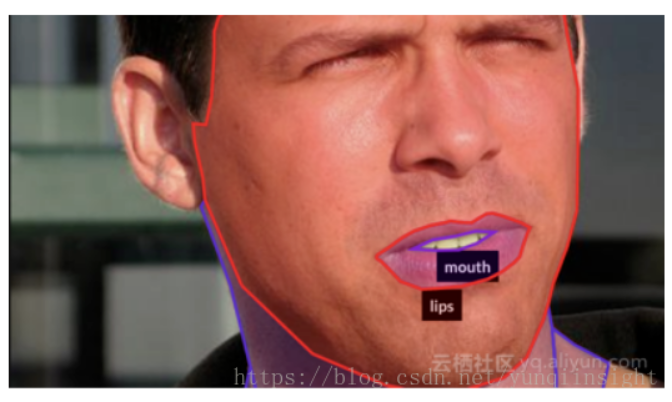
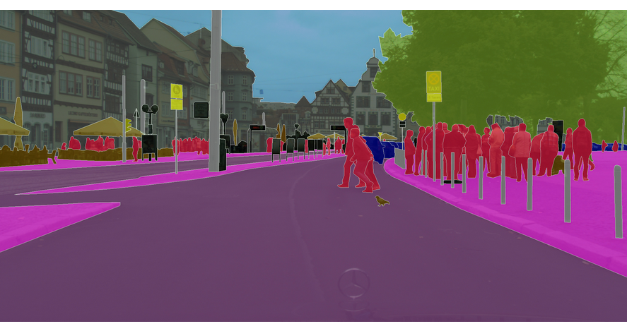
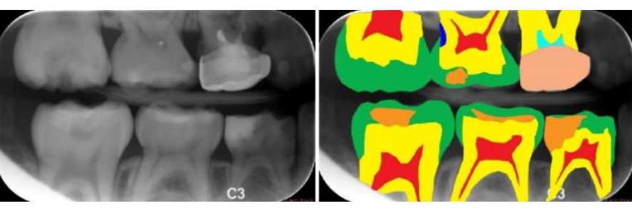

# 语义分割的应用
图像语义分割（semantic segmentation），从字面意思上理解就是让计算机根据图像的语义来进行分割。语义分割是在像素级别上的分类，属于同一类的像素都要被归为一类，因此语义分割是从像素级别来理解图像的。语义在语音识别中指的是语音的意思，在图像领域，语义指的是图像的内容，对图片意思的理解；分割的意思是从像素的角度分割出图片中的不同对象，对原图中的每个像素都进行标注。

## 地理信息系统
可以通过训练神经网络让机器输入卫星遥感影像，自动识别道路，河流，庄稼，建筑物等，并且对图像中每个像素进行标注。(左边为卫星遥感影像，中间为真实的标签，右边为神经网络预测的标签结果）
神经网络预测的卫星遥感影像

## 面部分割
面部的语义分割通常涉及诸如皮肤、头发、眼睛、鼻子、嘴巴和背景等的分类。面部分割在计算机视觉的许多面部应用中是有用的，例如性别、表情、年龄和种族的估计。
神经网络预测的面部图像

## 无人车驾驶
语义分割也是无人车驾驶的核心算法技术，车载摄像头，或者激光雷达探查到图像后输入到神经网络中，后台计算机可以自动将图像分割归类，以避让行人和车辆等障碍。 
神经网络预测的雷达影像

## 医疗影像分析
神经网络与医疗诊断结合也成为近期研究热点，智能医疗研究逐渐成熟。在智能医疗领域，语义分割主要应用有肿瘤图像分割，龋齿诊断等。
神经网络预测的龋齿影像
