# 数据处理

## 数据预览

船舶图像：（19万张左右）

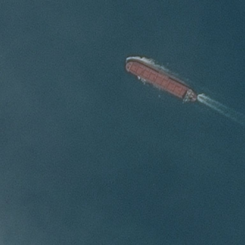

数据目标：（保存在csv表格中）

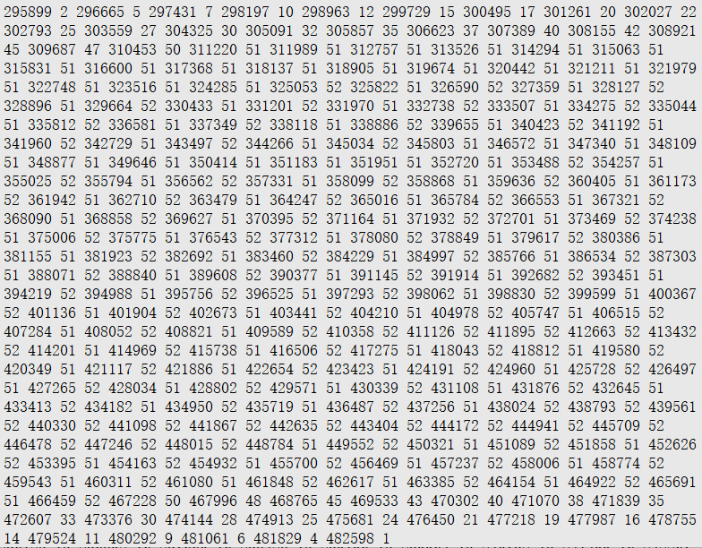

这是所得数据的rle编码，解码效果如下：

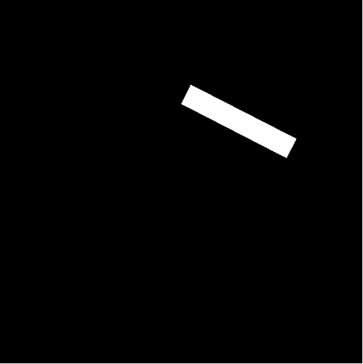

## 数据解码

Rle编码（Run Length Encoding），它的原理是通过检测统计数据流中重复的位或字符序列，并用它们出现的次数和每次出现的个数形成新的代码。从而达到数据压缩的目的。

例如，“5 3 10 4”表示，目标所在位置包括：第5个像素点开始连续的3个像素点和第10个像素点开始连续的4个像素点。

Rle解码算法：

新建一张全0图像，对其修改对应的目标像素为1。

Rle解码代码如下：

```
def rle_to_array(img, rles):
    l, w = img.shape[0], img.shape[1]
    x = np.asarray(img).reshape((l, w, 3))
    y = np.zeros(l * w, dtype=np.uint8)

    for rle in rles.values:
        if rle is np.nan:
            break
        rle = rle.split(' ')
        starts, lengths = [np.asarray(x, dtype=int) for x in (rle[0:][::2], rle[1:][::2])]
        starts -= 1
        ends = starts + lengths
        for s, e in zip(starts, ends):
            y[s:e] = 1

    y = y.reshape((l, w)).T.reshape((l, w, 1))
    return x, y
```
## 数据清洗

删除数据中的残缺图像、模糊图像、重复图像。


对粘连的小船舶数据，实行部分舍弃或合并。

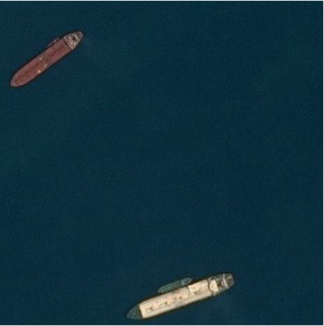

## 数据平衡

由于图像中的船只数量并不固定，因此我们将其分类：

### 先按照有无船只分类

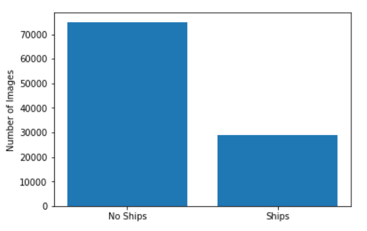

无船图像大概有15万张，有船图像大概有4万张。


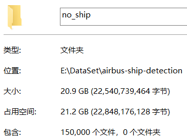

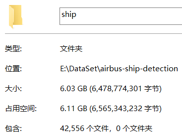

### 再根据船只数量分类

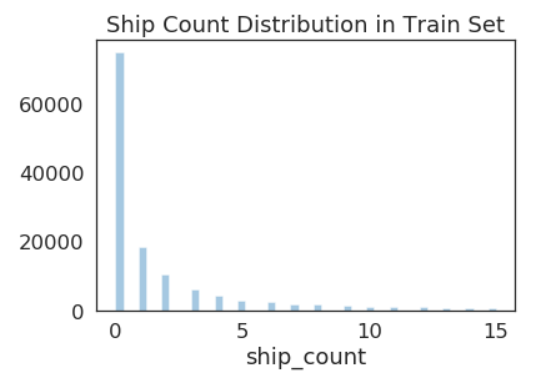

特点为：图像中船只数量越多，图像数量越少。

### 将不同船只数量的图像按比例结合

将每种图像都取出一部分放入预准备数据中，使各种数据比例大致相同，得到一个平衡的预准备数据。（无船图像数据中包含内容较少，不取）

## 数据生成

由于原始数据是RGB图像数据，所占内存较大，为了防止内存溢出，制作一个数据生成器。

定义一个循环，不断地用随机数选择图像数据，选择后将目标数据进行解码处理得到L图像数据，最后将RGB图像和L图像抛出。

代码如下：

```
def generator(imgs, results, batch_size, seed=None):
    if seed:
        np.random.seed(seed)
    ImageId, EncodedPixels = results["ImageId"], results["EncodedPixels"]
    while True:
        samples = np.random.choice(imgs, size=batch_size)
        X, Y = [], []
        for s in samples:
            img = Image.open(img_path)
            rles = EncodedPixels[ImageId == s]
            x, y = rle_to_array(img, rles)
            X.append(x)
            Y.append(y)
        X, Y = np.asarray(X) / 255, np.asarray(Y)
        yield (X, Y)
```

## 数据增强

使用keras库的ImageDataGenerator，设置多种参数使图像进行各种变换而产生更多的数据。

常用参数设置：

|参数|功能|
|:----:|:----:|
|Rotation_range|图像随即旋转的角度范围|
|width_shift/height_shift|图像在水平或垂直方向上的平移范围|
|Shear_range|随机错切变换的范围|
|Zoom_range|图像随机缩放的范围|
|Horizontal_flip|随机将一半图像水平翻转|
|Fill_mode|用于填充新创建像素的方法|

例：

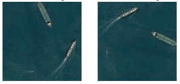

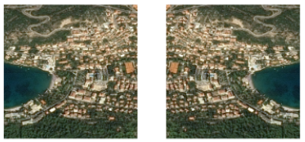

# 模型建立

## U-net简介


模型的结构十分的对称，左边为一系列连续地卷积池化，而右边则相反，为一系列连续地上采样卷积，而图中灰色箭头则是残差连接，将浅层特征与深层特征结合，避免了特征的损失，此模型因结构形似“U”形，而被称为U-net。

## 模型搭建

### 卷积池化

```
c = Conv2D(8, (3, 3), activation='relu', padding='same')(x)
c = Conv2D(8, (3, 3), activation='relu', padding='same')(c)
p = MaxPooling2D((2, 2))(c)
```

### 拼接+反卷积

```
c2 = Conv2DTranspose(8, (2, 2), strides=(2, 2), padding='same')(c)
m = concatenate([c1, c2], axis=3)
c = Conv2D(8, (3, 3), activation='relu', padding='same')(m)
c = Conv2D(8, (3, 3), activation='relu', padding='same')(c)
```

Conv2DTranspose可用UpSampling2D+Conv2D代替。

### 添加批标准化层

```
c = BatchNormalization()(c)
```

统一分布，加强网络的泛化能力；

使用更高的学习率，加快训练速度；

充当Dropout，防止过拟合。

### 优化器与损失

optimizer使用Adam优化器，loss取(1-IoU)，IoU是预测图像与真实图像的重合率，IoU越大，loss越小。

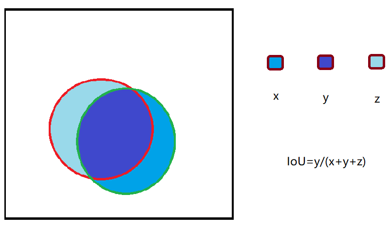

### 输入输出

```
input = Input((512, 512, 3))
output = Conv2D(1, (1, 1), activation='sigmoid')(c)
```

输入RGB图像，输出01图像，实质是像素点矩阵。

### 模型结果

```
__________________________________________________________________________________________________
Layer (type)                    Output Shape         Param #     Connected to                     
==================================================================================================
input_1 (InputLayer)            (None, 512, 512, 3)  0                                            
__________________________________________________________________________________________________
conv2d_1 (Conv2D)               (None, 512, 512, 8)  224         input_1[0][0]                    
__________________________________________________________________________________________________
batch_normalization_1 (BatchNor (None, 512, 512, 8)  32          conv2d_1[0][0]                   
__________________________________________________________________________________________________
conv2d_2 (Conv2D)               (None, 512, 512, 8)  584         batch_normalization_1[0][0]      
__________________________________________________________________________________________________
batch_normalization_2 (BatchNor (None, 512, 512, 8)  32          conv2d_2[0][0]                   
__________________________________________________________________________________________________
max_pooling2d_1 (MaxPooling2D)  (None, 256, 256, 8)  0           batch_normalization_2[0][0]      
__________________________________________________________________________________________________
conv2d_3 (Conv2D)               (None, 256, 256, 16) 1168        max_pooling2d_1[0][0]            
__________________________________________________________________________________________________
batch_normalization_3 (BatchNor (None, 256, 256, 16) 64          conv2d_3[0][0]                   
__________________________________________________________________________________________________
conv2d_4 (Conv2D)               (None, 256, 256, 16) 2320        batch_normalization_3[0][0]      
__________________________________________________________________________________________________
batch_normalization_4 (BatchNor (None, 256, 256, 16) 64          conv2d_4[0][0]                   
__________________________________________________________________________________________________
max_pooling2d_2 (MaxPooling2D)  (None, 128, 128, 16) 0           batch_normalization_4[0][0]      
__________________________________________________________________________________________________
conv2d_5 (Conv2D)               (None, 128, 128, 32) 4640        max_pooling2d_2[0][0]            
__________________________________________________________________________________________________
batch_normalization_5 (BatchNor (None, 128, 128, 32) 128         conv2d_5[0][0]                   
__________________________________________________________________________________________________
conv2d_6 (Conv2D)               (None, 128, 128, 32) 9248        batch_normalization_5[0][0]      
__________________________________________________________________________________________________
batch_normalization_6 (BatchNor (None, 128, 128, 32) 128         conv2d_6[0][0]                   
__________________________________________________________________________________________________
max_pooling2d_3 (MaxPooling2D)  (None, 64, 64, 32)   0           batch_normalization_6[0][0]      
__________________________________________________________________________________________________
conv2d_7 (Conv2D)               (None, 64, 64, 64)   18496       max_pooling2d_3[0][0]            
__________________________________________________________________________________________________
batch_normalization_7 (BatchNor (None, 64, 64, 64)   256         conv2d_7[0][0]                   
__________________________________________________________________________________________________
conv2d_8 (Conv2D)               (None, 64, 64, 64)   36928       batch_normalization_7[0][0]      
__________________________________________________________________________________________________
batch_normalization_8 (BatchNor (None, 64, 64, 64)   256         conv2d_8[0][0]                   
__________________________________________________________________________________________________
max_pooling2d_4 (MaxPooling2D)  (None, 32, 32, 64)   0           batch_normalization_8[0][0]      
__________________________________________________________________________________________________
conv2d_9 (Conv2D)               (None, 32, 32, 128)  73856       max_pooling2d_4[0][0]            
__________________________________________________________________________________________________
batch_normalization_9 (BatchNor (None, 32, 32, 128)  512         conv2d_9[0][0]                   
__________________________________________________________________________________________________
conv2d_10 (Conv2D)              (None, 32, 32, 128)  147584      batch_normalization_9[0][0]      
__________________________________________________________________________________________________
batch_normalization_10 (BatchNo (None, 32, 32, 128)  512         conv2d_10[0][0]                  
__________________________________________________________________________________________________
conv2d_transpose_1 (Conv2DTrans (None, 64, 64, 64)   32832       batch_normalization_10[0][0]     
__________________________________________________________________________________________________
concatenate_1 (Concatenate)     (None, 64, 64, 128)  0           batch_normalization_8[0][0]      
                                                                 conv2d_transpose_1[0][0]         
__________________________________________________________________________________________________
conv2d_11 (Conv2D)              (None, 64, 64, 64)   73792       concatenate_1[0][0]              
__________________________________________________________________________________________________
conv2d_12 (Conv2D)              (None, 64, 64, 64)   36928       conv2d_11[0][0]                  
__________________________________________________________________________________________________
conv2d_transpose_2 (Conv2DTrans (None, 128, 128, 32) 8224        conv2d_12[0][0]                  
__________________________________________________________________________________________________
concatenate_2 (Concatenate)     (None, 128, 128, 64) 0           batch_normalization_6[0][0]      
                                                                 conv2d_transpose_2[0][0]         
__________________________________________________________________________________________________
conv2d_13 (Conv2D)              (None, 128, 128, 32) 18464       concatenate_2[0][0]              
__________________________________________________________________________________________________
conv2d_14 (Conv2D)              (None, 128, 128, 32) 9248        conv2d_13[0][0]                  
__________________________________________________________________________________________________
conv2d_transpose_3 (Conv2DTrans (None, 256, 256, 16) 2064        conv2d_14[0][0]                  
__________________________________________________________________________________________________
concatenate_3 (Concatenate)     (None, 256, 256, 32) 0           batch_normalization_4[0][0]      
                                                                 conv2d_transpose_3[0][0]         
__________________________________________________________________________________________________
conv2d_15 (Conv2D)              (None, 256, 256, 16) 4624        concatenate_3[0][0]              
__________________________________________________________________________________________________
conv2d_16 (Conv2D)              (None, 256, 256, 16) 2320        conv2d_15[0][0]                  
__________________________________________________________________________________________________
conv2d_transpose_4 (Conv2DTrans (None, 512, 512, 8)  520         conv2d_16[0][0]                  
__________________________________________________________________________________________________
concatenate_4 (Concatenate)     (None, 512, 512, 16) 0           batch_normalization_2[0][0]      
                                                                 conv2d_transpose_4[0][0]         
__________________________________________________________________________________________________
conv2d_17 (Conv2D)              (None, 512, 512, 8)  1160        concatenate_4[0][0]              
__________________________________________________________________________________________________
conv2d_18 (Conv2D)              (None, 512, 512, 8)  584         conv2d_17[0][0]                  
__________________________________________________________________________________________________
conv2d_19 (Conv2D)              (None, 512, 512, 1)  9           conv2d_18[0][0]                  
==================================================================================================
```

## 参数调优

由于模型较为复杂，常用的GridSearch与RandomSearch需要耗费大量时间，所有我们打算手动调参。

主要参数：轮数初始为10，次数初始为32，个数初始为2。

### 选择轮数（对全部数据训练的轮数）

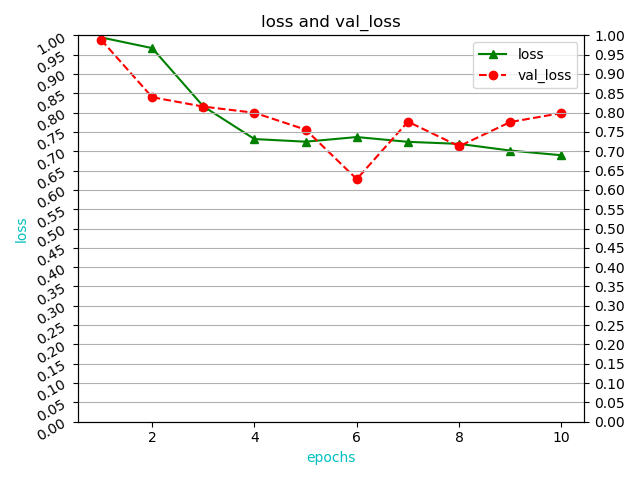


轮数：由loss图像所得，设置为5。

### 选择次数（一轮中训练的次数）

次数：次数=样本数/个数。

### 选择个数（一次训练的样本数）

个数：由于16张图片内存过大，而2张图片效果较差，所以设置为4。