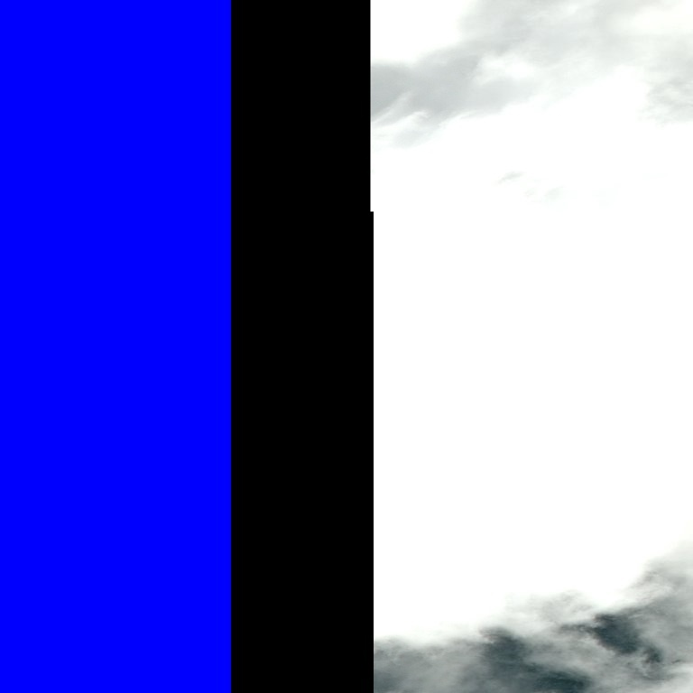
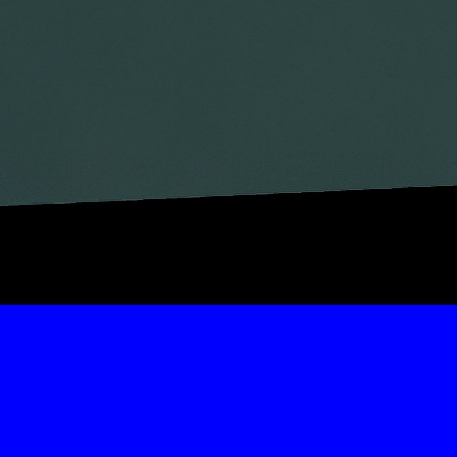
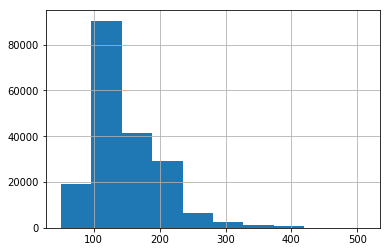
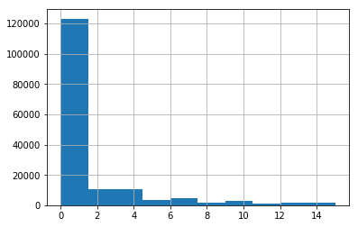
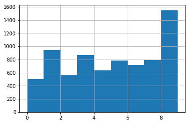
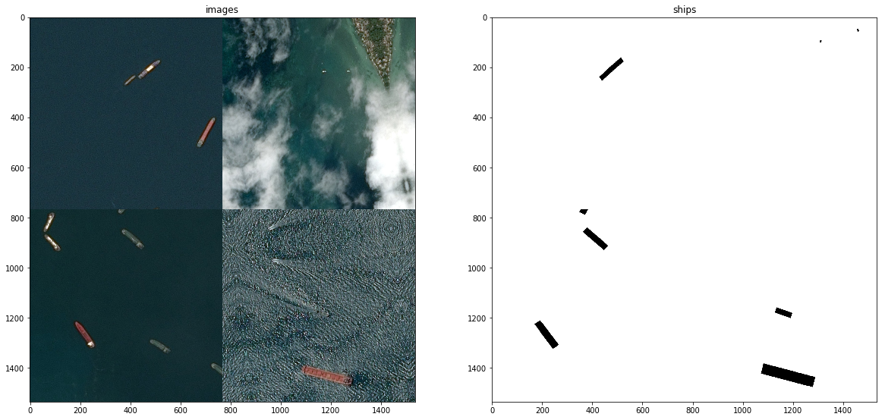

# 数据预处理

## 数据格式

根据我们得到的卫星图像船舶识别数据集，文件主要分为四个部分：

- sample_submission_v2.csv
- test_v2
- train_ship_segmentations_v2.csv
- train_v2

分别对应样本提交集、测试集、验证集、训练集。

训练集约有200000张768x768的卫星船舶图像，近30G大小。

以下代码用于查看图像张数：

    masks = pd.read_csv(os.path.join('../input/airbus-ship-detection/',
                                    'train_ship_segmentations_v2.csv'))
    print(masks.shape[0], 'masks found')
    print(masks['ImageId'].value_counts().shape[0])
    masks.head()

结果如下：

    231723 masks found
    192556
        ImageId         EncodedPixels
    0	00003e153.jpg	NaN
    1	0001124c7.jpg	NaN
    2	000155de5.jpg	264661 17 265429 33 266197 33 266965 33 267733...
    3	000194a2d.jpg	360486 1 361252 4 362019 5 362785 8 363552 10 ...
    4	000194a2d.jpg	51834 9 52602 9 53370 9 54138 9 54906 9 55674 ...

## RLE编码

从上面代码我们可以看到train_ship_segmentations_v2.csv是一个表格，表格有两列，分别是图像id和编码信息，这个编码方式是为RLE，英文名为run-length encoding，翻译为游程编码，又译行程长度编码，又称变动长度编码法（run coding），在控制论中对于二值图像而言是一种编码方法，对连续的黑、白像素数(游程)以不同的码字进行编码。游程编码是一种简单的非破坏性资料压缩法，其好处是加压缩和解压缩都非常快。其方法是计算连续出现的资料长度压缩之。具体来说，RLE编码对图像每个像素点进行编号，用一个二元组(id,length)表示第id个像素点及往后走length长度的像素点都被标记了。这样编码可以大大节约内存，可以准确表示船舶被标注的位置。

### RLE解码

关于RLE编码，将其解码成图片的代码如下：

    # ref: https://www.kaggle.com/paulorzp/run-length-encode-and-decode
    def rle_encode(img):
        '''
        img: numpy array, 1 - mask, 0 - background
        Returns run length as string formated
        '''
        pixels = img.T.flatten()
        pixels = np.concatenate([[0], pixels, [0]])
        runs = np.where(pixels[1:] != pixels[:-1])[0] + 1
        runs[1::2] -= runs[::2]
        return ' '.join(str(x) for x in runs)

    def rle_decode(mask_rle, shape=(768, 768)):
        '''
        mask_rle: run-length as string formated (start length)
        shape: (height,width) of array to return 
        Returns numpy array, 1 - mask, 0 - background
        '''
        s = mask_rle.split()
        starts, lengths = [np.asarray(x, dtype=int) for x in (s[0:][::2], s[1:][::2])]
        starts -= 1
        ends = starts + lengths
        img = np.zeros(shape[0]*shape[1], dtype=np.uint8)
        for lo, hi in zip(starts, ends):
            img[lo:hi] = 1
        return img.reshape(shape).T  # Needed to align to RLE direction

    def masks_as_image(in_mask_list):
        # Take the individual ship masks and create a single mask array for all ships
        all_masks = np.zeros((768, 768), dtype = np.int16)
        #if isinstance(in_mask_list, list):
        for mask in in_mask_list:
            if isinstance(mask, str):
                all_masks += rle_decode(mask)
        return np.expand_dims(all_masks, -1)

以上代码包含了RLE格式的编码、解码，以及将RLE格式转换成一张图像。

图展示了一张RLE解码后的图像，高亮部分表示被标记的船舶。

## 剔除脏数据

脏数据（Dirty Read）是指源系统中的数据不在给定的范围内或对于实际业务毫无意义，或是数据格式非法，以及在源系统中存在不规范的编码和含糊的业务逻辑。

在数据处理中，对于一些对训练无用或者用处极小的数据进行筛除，从而提升训练效果。

本文发现，在文件大小小于50Kb时，较为频繁地出现无用的图像，所以在进行数据预处理的时候将文件大小小于50Kb的图像删掉了。

图展示了部分非法的图像。

## 分隔训练集和验证集

    masks['ships'] = masks['EncodedPixels'].map(lambda c_row: 1 if isinstance(c_row, str) else 0)
    unique_img_ids = masks.groupby('ImageId').agg({'ships': 'sum'}).reset_index()
    unique_img_ids['has_ship'] = unique_img_ids['ships'].map(lambda x: 1.0 if x>0 else 0.0)
    unique_img_ids['has_ship_vec'] = unique_img_ids['has_ship'].map(lambda x: [x])
    # some files are too small/corrupt
    unique_img_ids['file_size_kb'] = unique_img_ids['ImageId'].map(lambda c_img_id: 
                                                                os.stat(os.path.join(train_image_dir, 
                                                                                        c_img_id)).st_size/1024)
    unique_img_ids = unique_img_ids[unique_img_ids['file_size_kb']>50] # keep only 50kb files
    unique_img_ids['file_size_kb'].hist()
    masks.drop(['ships'], axis=1, inplace=True)
    unique_img_ids.sample(5)

以上代码实现了以下操作：

1. 统计出每张卫星图片囊括的船数
2. 将有船和无船的图片分开，剔除图片文件小于50kb的图片
3. 查看文件大小的分布以及处理后的数据

结果如下：

            ImageId	        ships	has_ship	has_ship_vec	file_size_kb
    43824	3a704c694.jpg	0	    0.0	        [0.0]	        134.526367
    16053	155a58719.jpg	0	    0.0	        [0.0]	        131.833984
    95804	7f633690c.jpg	0	    0.0	        [0.0]	        156.706055
    129050	aba2ef0f5.jpg	9	    1.0	        [1.0]	        208.094727
    119822	9f5ef085c.jpg	0	    0.0	        [0.0]	        186.836914

图展示了处理后文件大小的分布图，可以看出文件大小较为均匀地分布在120Kb左右。

以下代码用于以船只数为分层，7:3为比例，将原图像集分隔为训练集、验证集：

    from sklearn.model_selection import train_test_split
    train_ids, valid_ids = train_test_split(unique_img_ids, 
                    test_size = 0.3, 
                    stratify = unique_img_ids['ships'])
    train_df = pd.merge(masks, train_ids)
    valid_df = pd.merge(masks, valid_ids)
    print(train_df.shape[0], 'training masks')
    print(valid_df.shape[0], 'validation masks')

运行结果如下：

    161048 training masks
    69034 validation masks

得到161048训练用图像，69034验证用图像。

### 基于船只数的重采样

以下代码用于显示船只分布的直方图：

    train_df['ships'].hist()

结果如图，可以看出无船的图像数量明显多于有船的图像的数量，有少量船的图像数量明显多于有多数船的图像数量，这就导致一个问题——数据不平衡。

所谓的不平衡数据集指的是数据集各个类别的样本量极不均衡。以二分类问题为例，假设正类的样本数量远大于负类的样本数量，通常情况下通常情况下把多数类样本的比例接近100:1这种情况下的数据称为不平衡数据。不平衡数据的学习即需要在分布不均匀的数据集中学习到有用的信息。

为了对数据集进行平衡化，本文将对训练数据进行重采样，即对图片数量多的样本进行欠采样，对样本数量少的样本进行过采样，代码如下：

    train_df['grouped_ship_count'] = train_df['ships'].map(lambda x: (x+1)//2).clip(0, 7)
    def sample_ships(in_df, base_rep_val=1500):
        if in_df['ships'].values[0]==0:
            return in_df.sample(base_rep_val//3) # even more strongly undersample no ships
        else:
            return in_df.sample(base_rep_val, replace=(in_df.shape[0]<base_rep_val))
        
    balanced_train_df = train_df.groupby('grouped_ship_count').apply(sample_ships)
    balanced_train_df['ships'].hist(bins=np.arange(10))

采样后船只分布情况如图，可以看出，船只数量得到了较为均匀的分布，将更有助于训练结果。

## 数据生成器

由于卫星图像数据量过于庞大，一次性将所有训练图片读入内存进行训练，不仅内存吃紧，而且没有必要。正确做法应该是将数据分批次读入，每次读入指定数量张，分批训练，如此效果良好，而且解决了内存吃紧的问题。

如此操作需要编写数据生成器，在python和C#语言中，对应的是yield关键字，用于产生一个generator生成器，代码如下：

    def make_image_gen(in_df, batch_size = BATCH_SIZE):
        all_batches = list(in_df.groupby('ImageId'))
        out_rgb = []
        out_mask = []
        while True:
            np.random.shuffle(all_batches)
            for c_img_id, c_masks in all_batches:
                rgb_path = os.path.join(train_image_dir, c_img_id)
                c_img = imread(rgb_path)
                c_mask = masks_as_image(c_masks['EncodedPixels'].values)
                if IMG_SCALING is not None:
                    c_img = c_img[::IMG_SCALING[0], ::IMG_SCALING[1]]
                    c_mask = c_mask[::IMG_SCALING[0], ::IMG_SCALING[1]]
                out_rgb += [c_img]
                out_mask += [c_mask]
                if len(out_rgb)>=batch_size:
                    yield np.stack(out_rgb, 0)/255.0, np.stack(out_mask, 0)
                    out_rgb, out_mask=[], []

    train_gen = make_image_gen(balanced_train_df)
    train_x, train_y = next(train_gen)
    print('x', train_x.shape, train_x.min(), train_x.max())
    print('y', train_y.shape, train_y.min(), train_y.max())

运行结果如下：

    x (4, 768, 768, 3) 0.0 1.0
    y (4, 768, 768, 1) 0 1

可以看出每次取出4张图片，并且对图片的点值进行了归一化处理

以下代码用于验证数据生成器产生的结果：

    fig, (ax1, ax2, ax3) = plt.subplots(1, 3, figsize = (30, 10))
    batch_rgb = montage_rgb(train_x)
    batch_seg = montage(train_y[:, :, :, 0])
    ax1.imshow(batch_rgb)
    ax1.set_title('Images')
    ax2.imshow(batch_seg)
    ax2.set_title('Segmentations')
    ax3.imshow(mark_boundaries(batch_rgb, 
                            batch_seg.astype(int)))
    ax3.set_title('Outlined Ships')
    fig.savefig('overview.png')

结果如图，其中图一表示了卫星图像原图像，图二表示了在卫星图像的船只标注结果，图三表示了卫星图像原图像与标注结果相结合的图像。

以下代码用于生成验证集

    valid_x, valid_y = next(make_image_gen(valid_df, VALID_IMG_COUNT))
    print(valid_x.shape, valid_y.shape)

运行结果如下：

    (400, 768, 768, 3) (400, 768, 768, 1)

## 数据集增强

数据集增强主要是为了减少网络的过拟合现象，通过对训练图片进行变换可以得到泛化能力更强的网络，更好的适应应用场景。

常用的数据集增强方法有：

- 旋转|反射变换(Rotation/reflection): 随机旋转图像一定角度; 改变图像内容的朝向;
- 翻转变换(flip): 沿着水平或者垂直方向翻转图像;
- 缩放变换(zoom): 按照一定的比例放大或者缩小图像;
- 平移变换(shift): 在图像平面上对图像以一定方式进行平移;
- 可以采用随机或人为定义的方式指定平移范围和平移步长, 沿水平或竖直方向进行平移. 改变图像内容的位置;
- 尺度变换(scale): 对图像按照指定的尺度因子, 进行放大或缩小; 或者参照SIFT特征提取思想, 利用指定的尺度因子对图像滤波构造尺度空间. 改变图像内容的大小或模糊程度;
- 对比度变换(contrast): 在图像的HSV颜色空间，改变饱和度S和V亮度分量，保持色调H不变. 对每个像素的S和V分量进行指数运算(指数因子在0.25到4之间), 增加光照变化;
- 噪声扰动(noise): 对图像的每个像素RGB进行随机扰动, 常用的噪声模式是椒盐噪声和高斯噪声;
- 颜色变化：在图像通道上添加随机扰动。
- 输入图像随机选择一块区域涂黑，参考《Random Erasing Data Augmentation》。

以下代码用于对卫星图像进行数据集增强并生成对应的生成器：

    from keras.preprocessing.image import ImageDataGenerator
    dg_args = dict(featurewise_center = False, 
                    samplewise_center = False,
                    rotation_range = 15, # 旋转范围
                    width_shift_range = 0.1, # 水平平移范围
                    height_shift_range = 0.1, # 垂直平移范围
                    shear_range = 0.01, # 透视变化的范围
                    zoom_range = [0.9, 1.25], # 缩放范围
                    horizontal_flip = True, # 水平翻转
                    vertical_flip = True, # 垂直翻转
                    fill_mode = 'reflect', # 填充模式
                    data_format = 'channels_last') # 数据格式为通道last
    # brightness can be problematic since it seems to change the labels differently from the images 
    if AUGMENT_BRIGHTNESS:
        dg_args[' brightness_range'] = [0.5, 1.5] # 亮度范围
    image_gen = ImageDataGenerator(**dg_args)

    if AUGMENT_BRIGHTNESS:
        dg_args.pop('brightness_range')
    label_gen = ImageDataGenerator(**dg_args)

    def create_aug_gen(in_gen, seed = None):
        np.random.seed(seed if seed is not None else np.random.choice(range(9999)))
        for in_x, in_y in in_gen:
            seed = np.random.choice(range(9999))
            # keep the seeds syncronized otherwise the augmentation to the images is different from the masks
            g_x = image_gen.flow(255*in_x, 
                                batch_size = in_x.shape[0], 
                                seed = seed, 
                                shuffle=True)
            g_y = label_gen.flow(in_y, 
                                batch_size = in_x.shape[0], 
                                seed = seed, 
                                shuffle=True)

            yield next(g_x)/255.0, next(g_y)

以下代码用于展示增强后的数据：

    cur_gen = create_aug_gen(train_gen)
    t_x, t_y = next(cur_gen)
    print('x', t_x.shape, t_x.dtype, t_x.min(), t_x.max())
    print('y', t_y.shape, t_y.dtype, t_y.min(), t_y.max())
    # only keep first 9 samples to examine in detail
    t_x = t_x[:9]
    t_y = t_y[:9]
    fig, (ax1, ax2) = plt.subplots(1, 2, figsize = (20, 10))
    ax1.imshow(montage_rgb(t_x), cmap='gray')
    ax1.set_title('images')
    ax2.imshow(montage(t_y[:, :, :, 0]), cmap='gray_r')
    ax2.set_title('ships')

运行结果如下：

    x (4, 768, 768, 3) float32 0.0 1.0
    y (4, 768, 768, 1) float32 0.0 1.0

结果如图，可以看出图像被处理过的痕迹。