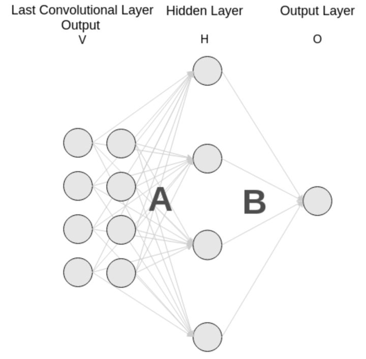
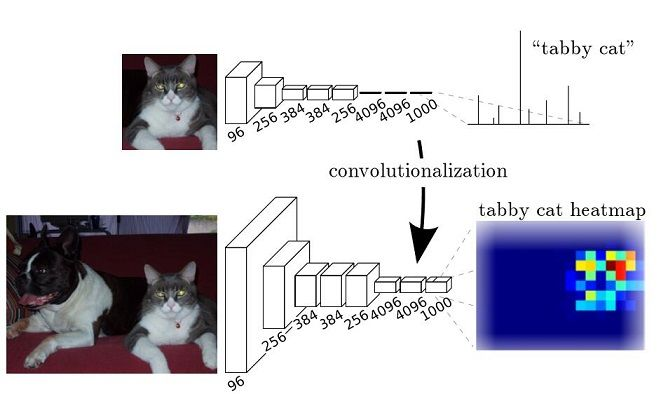
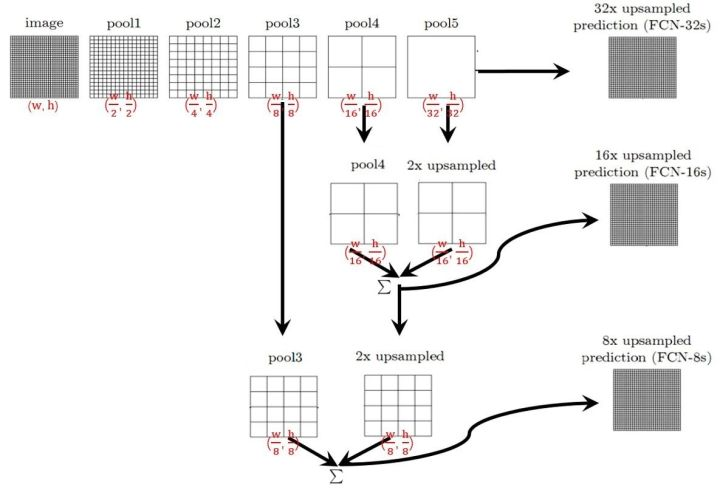
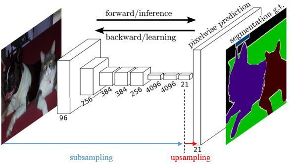
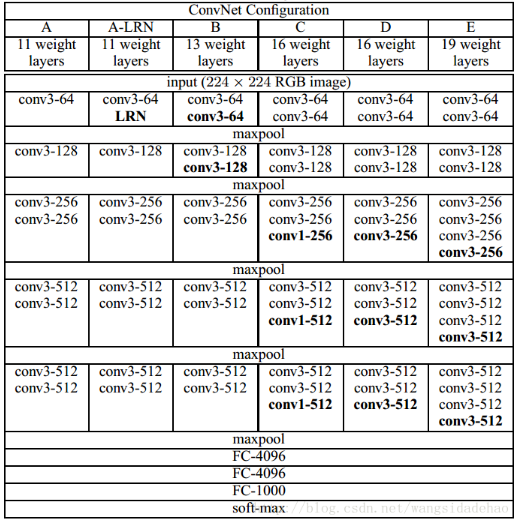
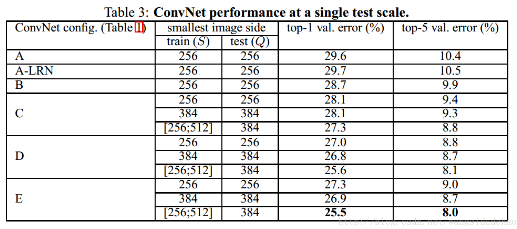
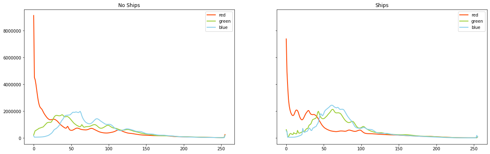
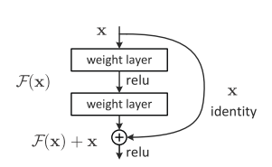
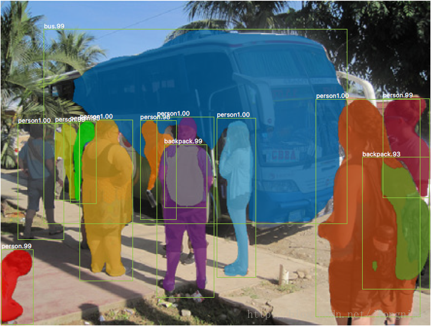

# 模型选择

## SOFA

一般来说我们会根据问题类型和数据情况决定使用哪种**SOFA**（state-of-the-art）模型。很明显这是一个图像分割问题，且我们的数据集分布比较有特点，分割的主体——船只在数据集中大多以单船和双船（分散居多）出现，多船的情况占少数，识别目标较为单一，因此我们可以考虑把这个问题看做为语义分割，即对输入图像中的每个像素分配一个语义类别，以得到像素化的密集分类。而在语义分割这个方向的SOFA模型当属以ResNet为基础的U-Net模型，因此最终我们敲定了选择U-Net模型作为我们的backbone


## U-net Model

基于pytorch实现的Unet基本框架

```
# 下采样
class UNet_down_block(torch.nn.Module):
    def __init__(self, input_channel, output_channel, down_size):
        super(UNet_down_block, self).__init__()
        self.conv1 = torch.nn.Conv2d(input_channel, output_channel, 3, padding=1)
        self.bn1 = torch.nn.BatchNorm2d(output_channel)
        self.conv2 = torch.nn.Conv2d(output_channel, output_channel, 3, padding=1)
        self.bn2 = torch.nn.BatchNorm2d(output_channel)
        self.conv3 = torch.nn.Conv2d(output_channel, output_channel, 3, padding=1)
        self.bn3 = torch.nn.BatchNorm2d(output_channel)
        self.max_pool = torch.nn.MaxPool2d(2, 2)
        self.relu = torch.nn.ReLU()
        self.down_size = down_size

    def forward(self, x):
        if self.down_size:
            x = self.max_pool(x)
        x = self.relu(self.bn1(self.conv1(x)))
        x = self.relu(self.bn2(self.conv2(x)))
        x = self.relu(self.bn3(self.conv3(x)))
        return x

# 上采样
class UNet_up_block(torch.nn.Module):
    def __init__(self, prev_channel, input_channel, output_channel):
        super(UNet_up_block, self).__init__()
        self.up_sampling = torch.nn.Upsample(scale_factor=2, mode='bilinear')
        self.conv1 = torch.nn.Conv2d(prev_channel + input_channel, output_channel, 3, padding=1)
        self.bn1 = torch.nn.BatchNorm2d(output_channel)
        self.conv2 = torch.nn.Conv2d(output_channel, output_channel, 3, padding=1)
        self.bn2 = torch.nn.BatchNorm2d(output_channel)
        self.conv3 = torch.nn.Conv2d(output_channel, output_channel, 3, padding=1)
        self.bn3 = torch.nn.BatchNorm2d(output_channel)
        self.relu = torch.nn.ReLU()

    def forward(self, prev_feature_map, x):
        x = self.up_sampling(x)
        x = torch.cat((x, prev_feature_map), dim=1)
        x = self.relu(self.bn1(self.conv1(x)))
        x = self.relu(self.bn2(self.conv2(x)))
        x = self.relu(self.bn3(self.conv3(x)))
        return x


class UNet(torch.nn.Module):
    def __init__(self):
        super(UNet, self).__init__()

        self.down_block1 = UNet_down_block(3, 16, False)
        self.down_block2 = UNet_down_block(16, 32, True)
        self.down_block3 = UNet_down_block(32, 64, True)
        self.down_block4 = UNet_down_block(64, 128, True)
        self.down_block5 = UNet_down_block(128, 256, True)
        self.down_block6 = UNet_down_block(256, 512, True)
        self.down_block7 = UNet_down_block(512, 1024, True)

        self.mid_conv1 = torch.nn.Conv2d(1024, 1024, 3, padding=1)
        self.bn1 = torch.nn.BatchNorm2d(1024)
        self.mid_conv2 = torch.nn.Conv2d(1024, 1024, 3, padding=1)
        self.bn2 = torch.nn.BatchNorm2d(1024)
        self.mid_conv3 = torch.nn.Conv2d(1024, 1024, 3, padding=1)
        self.bn3 = torch.nn.BatchNorm2d(1024)

        self.up_block1 = UNet_up_block(512, 1024, 512)
        self.up_block2 = UNet_up_block(256, 512, 256)
        self.up_block3 = UNet_up_block(128, 256, 128)
        self.up_block4 = UNet_up_block(64, 128, 64)
        self.up_block5 = UNet_up_block(32, 64, 32)
        self.up_block6 = UNet_up_block(16, 32, 16)

        self.last_conv1 = torch.nn.Conv2d(16, 16, 3, padding=1)
        self.last_bn = torch.nn.BatchNorm2d(16)
        self.last_conv2 = torch.nn.Conv2d(16, 1, 1, padding=0)
        self.relu = torch.nn.ReLU()

    def forward(self, x):
        self.x1 = self.down_block1(x)
        self.x2 = self.down_block2(self.x1)
        self.x3 = self.down_block3(self.x2)
        self.x4 = self.down_block4(self.x3)
        self.x5 = self.down_block5(self.x4)
        self.x6 = self.down_block6(self.x5)
        self.x7 = self.down_block7(self.x6)
        self.x7 = self.relu(self.bn1(self.mid_conv1(self.x7)))
        self.x7 = self.relu(self.bn2(self.mid_conv2(self.x7)))
        self.x7 = self.relu(self.bn3(self.mid_conv3(self.x7)))
        x = self.up_block1(self.x6, self.x7)
        x = self.up_block2(self.x5, x)
        x = self.up_block3(self.x4, x)
        x = self.up_block4(self.x3, x)
        x = self.up_block5(self.x2, x)
        x = self.up_block6(self.x1, x)
        x = self.relu(self.last_bn(self.last_conv1(x)))
        x = self.last_conv2(x)
        return x
```

### FCN(完全卷积神经网络)

对于一般的分类CNN网络，如VGG和Resnet，都会在网络的最后加入一些全连接层，经过softmax后就可以获得类别概率信息。但是这个概率信息是1维的，即只能标识整个图片的类别，不能标识每个像素点的类别，所以这种全连接方法不适用于图像分割。



而FCN提出可以把后面几个全连接都换成卷积，这样就可以获得一张2维的feature map，后接softmax获得每个像素点的分类信息，从而解决了分割问题。



整个FCN网络基本原理如图5（只是原理示意图）：

1. image经过多个conv和+一个max pooling变为pool1 feature，宽高变为1/2
2. pool1 feature再经过多个conv+一个max pooling变为pool2 feature，宽高变为1/4
3. pool2 feature再经过多个conv+一个max pooling变为pool3 feature，宽高变为1/8
4. ......
5. 直到pool5 feature，宽高变为1/32。



FCN网络很重要的一个操作时上采样。上采样（upsampling）一般包括2种方式：

1. Resize，如双线性插值直接缩放，类似于图像缩放（这种方法在原文中提到）
2. Deconvolution，也叫Transposed Convolution

传统的网络是subsampling的，对应的输出尺寸会降低；upsampling的意义在于将小尺寸的高维度feature map恢复回去，以便做pixelwise prediction，获得每个点的分类信息。



明显可以看到经过上采样后恢复了较大的pixelwise feature map（其中最后一个层21-dim是因为PACSAL数据集有20个类别+Background）。这其实相当于一个Encode-Decode的过程。

### ResNet(深度残差网络)

对于传统的深度学习网络，我们普遍认为网络深度越深（参数越多）非线性的表达能力越强，该网络所能学习到的东西就越多。我们凭借这一基本规则，经典的CNN网络从LetNet-5（5层）和AlexNet（8层）发展到VGGNet(16-19)，再到后来GoogleNet（22层）。根据VGGNet的实验结果可知，在某种程度上网络的深度对模型的性能至关重要，当增加网络层数后，网络可以进行更加复杂的特征模式的提取，所以当模型更深时理论上可以取得更好的结果，从下图也可以看出网络加深后效果可以变得更好





但是后来发现，CNN网络结构随着层数加深到一定程度之后，越深的网络反而效果更差，过深的网络会降低准确率



根据上图的结果可以看出：56层的网络比20层网络在训练数据上的损失还要大。这可以肯定不会是过拟合问题。因此，我们把这种问题称之为网络退化问题（Degradation problem）。

2015年，何恺明及他的团队提出的ResNet成功打破了先前无法建立更深层的神经网络的问题。ResNet的核心在于它在层与层之间添加了一条残差连接（shortcut）



* 记我们期望拟合的映射函数为$H(x)$
* 假定非线性堆叠层(stacked non-linear layers)拟合的函数为$F(x)$
* 定义$F(x) = H(x) - x$，即$H(x) = F(x) + x$

$$H(x)\longrightarrow{F(x) + x}$$

如上，由于残差连接的建立，恒等映射（x）的部分可以完整的传递至更深的网络层，原本由于非线性层对恒等映射拟合产生的误差累计就被完全消除了。

ResNet指出，由于神经网络中存在大量的非线性单元，神经网络对于恒等映射（Identity mapping）的拟合效果会很差，这也是为什么随着层数的加深准确率会降低的原因（i.e.误差累积的量级已经大于函数拟合的部分）。而残差连接建立了低层到高层的信息流连接，将原本被非线性单元修正的浅层信息直接传递给深层，由于神经网络具有自适应性，原本由神经网络拟合的部分中去除了浅层信息。这样就降低了误差累积量，所以深层网络的拟合效果也得到了加强。

### 基本框架（代码）

基于pytorch实现的ResNet-34基本框架

```
# Submodule: Residual Block
class ResidualBlock(nn.Module):
    def __init__(self, inchannel, outchannel, stride=1, shortcut=None):
        super(ResidualBlock, self).__init__()
        self.left = nn.Sequential(
            nn.Conv2d(inchannel, outchannel, 3, stride, 1, bias=False),
            nn.BatchNorm2d(outchannel),
            nn.ReLU(inplace=True),
            nn.Conv2d(outchannel, outchannel, 3, 1, 1, bias=False),
            nn.BatchNorm2d(outchannel)
        )
        self.right = shortcut

    def forward(self, x):
        out = self.left(x)
        residual = x if self.right is None else self.right(x)
        out += residual
        return F.relu(out)


# Main module: ResNet34
class ResNet(nn.Module):
    def __init__(self, num_classes=1000):
        super(ResNet, self).__init__()
        # Convert image
        self.pre = nn.Sequential(
            nn.Conv2d(3, 64, 7, 2, 3, bias=False),
            nn.BatchNorm2d(64),
            nn.ReLU(inplace=True),
            nn.MaxPool2d(3, 2, 1)
        )
        # 4 layers attached residual block
        self.layer1 = self._make_layer(64, 128, 3)
        self.layer2 = self._make_layer(128, 256, 4, stride=2)
        self.layer3 = self._make_layer(256, 512, 6, stride=2)
        self.layer4 = self._make_layer(512, 512, 3, stride=2)
        # full connection
        self.fc = nn.Linear(512, num_classes)

    def _make_layer(self, inchannel, outchannel, block_num, stride=1):
        shortcut = nn.Sequential(
            nn.Conv2d(inchannel, outchannel, 1, stride, bias=False),
            nn.BatchNorm2d(outchannel)
        )
        layers = []
        layers.append(ResidualBlock(inchannel, outchannel, stride, shortcut))
        for i in range(1, block_num):
            layers.append(ResidualBlock(outchannel, outchannel))
        return nn.Sequential(*layers)

    def forward(self, x):
        x = self.pre(x)
        x = self.layer1(x)
        x = self.layer2(x)
        x = self.layer3(x)
        x = self.layer4(x)
        x = F.avg_pool2d(x, 7)
        x = x.view(x.size(0), -1)
        return self.fc(x)
```

### 模型起源

过去在CNN用于分类任务时，人们只能图像输入，标签输出，但是在许多视觉任务中，比如生物医学图像处理中，人们希望得到针对每个像素的分类结果，并且获取大量的医学图像数据用于训练是不可能的，而U-net提出后这个问题慢慢得到了解决。

为了使分类网络可以运用至分割模型，U-net的设计基础基于一种专用于分割的网络结构**FCN**。FCN的主要思想是对常规的收缩网络进行补充，补充的内容是连续的layer，在这些层中，池化操作被上采样操作代替。因此，这些层提高了输出的解析度（resolution）。为了局部化（图像局部像素的label一样），将从收缩网络得到的高维特征与上采样的结果相结合，这样连续的卷积层就能从这种结合中汇聚更加准确的输出。同时，U-net基于ResNet的思想对FCN上采样的部分做出了改进，在U-net的上采样部分，我们也有大量的**feature channels**（i.e.残差连接），这些残差连接允许网络将范围信息（context）传播到高分辨率层，扩展层或多或少对称于收缩层，产生了一个U型的结构。该网络不包含任何全连接层，只使用每次卷积的有效部分，如，分割映射只包含像素，后面的高维特征包含全部语义信息。该方法允许任意大小的图像通过overlap-tile策略进行无缝分割。

FCN提供了分割的基本架构，而残差连接保证了语义信息的充分保留。因此，U-net成为了图像分割领域一款轻量级高性能的SOFA模型。

## Mask R-CNN

Mask R-CNN是ICCV 2017的best paper，彰显了机器学习计算机视觉领域在2017年的最新成果。在机器学习2017年的最新发展中，单任务的网络结构已经逐渐不再引人瞩目，取而代之的是集成，复杂，一石多鸟的多任务网络模型。



如图，在实例分割Mask R-CNN框架中，还是主要完成了三件事情：

1. 目标检测，直接在结果图上绘制了目标框(bounding box)。
2. 目标分类，对于每一个目标，需要找到对应的类别(class)，区分到底是人，是车，还是其他类别。
3. 像素级目标分割，在每个目标中，需要在像素层面区分，什么是前景，什么是背景。

由于Mask R-CNN过于复杂，本文仅简单介绍其理论，并没有实现。

## 相关参数

损失函数：交叉熵(Cross Entropy)

$$Cross Entropy: H(p, q) = \sum_xp(x)log(\frac{1}{q(x)})$$

分类器：softmax

$$Softmax: p_k(x) = \frac{e^{a_k(x)}}{\sum^K_{k=1}e^{a_k(x)}}$$

* $a_k(x)$表示像素点x对应特征通道k的得分 
* k表示类的数量
* $p_k(x)$表示类k对像素点x的分类结果

惩罚函数：利用交叉熵对每个像素点的输出概率进行惩罚

$$E = \sum_{x\in\Omega}\omega(x)log(p_{l(x)}(x))$$

* $l: \Omega\longrightarrow\{1, …, K\}$是每个像素的真实标签
* $\omega: \Omega\longrightarrow R$是像素的权重分布

边界分离：我们预先计算每个真实样本的权重图，以补偿训练数据集中某个类的像素的不同频率，利用权重实现像素级分类

$$\omega(x) = \omega_c(x)+\omega_0e^{-\frac{(d_1(x)+d_2(x))^2}{2\sigma^2}}$$

* $\omega_c: \Omega\longrightarrow R$用于平衡类间频率
* $d_1: \Omega\longrightarrow R$表示像素点到最近分割边界的距离
* $d_2: \Omega\longrightarrow R$表示像素点到第二近分割边界的距离

权重分离在分割中起到了至关重要的作用
