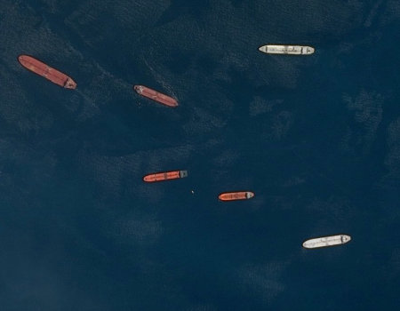
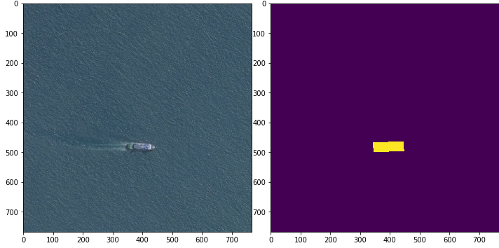
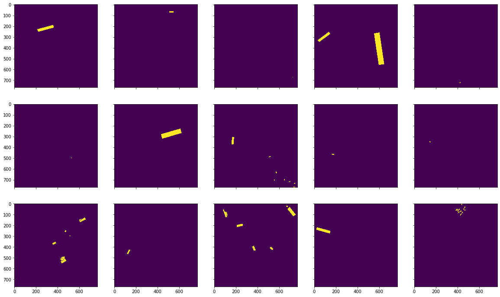
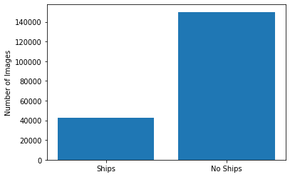
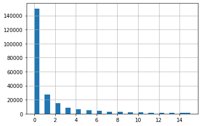

# 项目介绍

## 项目背景

21世纪是海洋世纪，在经济全球化和科技信息化迅猛发展、国家改革开放和新时期军事变革不断深入的背景下，中国的海防安全建设面临着许多新情况新问题。南海争端、钓鱼岛事件无不催促着中国的海防建设。美国的水下侦察器等高新科技也显示了我国与发达国家的差距。并且，航运量正在逐年增长，海上的违规行为诸如破坏性海事活动、海盗行为、贩毒和非法运输也在增长，这迫使许多国家组织机构密切关注公海海域船只问题。



同时，海面运动船只的目标检测、识别与跟踪技术在海上航行安全管理方面均有着广泛的应用。船只目标的检测受到众多因素如背景复杂、海上风浪、海面云雾、海水鳞光的反光等影响，使得船只检测的效果及鲁棒性较差。本项目将着眼于此，针对海面船只检测中存在的问题，提出基于深度学习的船只检测算法。

## 项目目标

我们需要在给定的卫星遥感图像中精确定位船只（找到船只并给出它的像素位置），用mask掩码来表示检测到的目标，如下图所示



## 评估标准

我们使用IoU(Intersection over Union)作为模型质量的评估标准。IoU分数是对象类别分割问题的标准性能度量。给定一组图像，IoU测量给出了在该组图像中存在的对象的预测区域和地面实况区域之间的相似性，并且由以下等式定义：

$$IoU = \frac{TP}{FP+TP+FN}$$

其中TP，FP和FN分别表示真阳性，假阳性和假阴性计数。鉴于FCN的输出表示的是分割像素是检测对象的一部分的可能性，是一个概率值，因此我们无法直接从网络输出中准确测量IoU得分，所以使用概率值来近似IoU分数。用V表示训练集中所有图像的所有像素的集合，用X表示训练集中像素概率的网络的输出，则IoU公式可重新定义为：

$$IoU = \frac{I(X)}{U(X)}$$

$$I(x) = \sum_{v\in V}X_v * Y_v$$

$$U(x) = \sum_{v\in V}(X_v + Y_v - X_v * Y_v)$$

我们的评估标准分为三个阶段，第一阶段保证预训练模型达到0.5及以上的IoU值；第二阶段以0.05的增长逐渐优化模型；第三阶段达到我们最终的期望标准：

$$\overline{\sum_V IoU}\geq0.7$$

## 数据来源

我们的数据源于Airbus空客公司向公众开放的卫星遥感船只图像数据集，在Airbus-OneAtla-Sandbox官方网站即可下载。


我们选择了ship-detection作为我们的数据集。除此之外该网站还提供了大量其他遥感数据（未经预处理，带标签）


# 数据探索和可视化（EDA）

## EDA的目的

由于我们的数据集比较庞大且杂乱，不可能人工去仔细查看每张图片的类型和特征呈现效果如何，我们必须借助自动随机抽样的方式让程序以可视化的形式告诉我们数据集的特征，以此为依据决定后面的工作（数据清洗、数据预处理等），因此EDA是进行数据处理前必不可少的一环

## 相关包的引入


```
import numpy as np # linear computation
import pandas as pd # data processing, CSV file I/O
from skimage.data import imread # read image
import matplotlib.pyplot as plt # plot
import os # path
from pathlib import Path
PATH = 'F:/[Base] Code/DataSets/airbus-ship-detection'
```

## 查看数据集格式

大多数带标签数据集都以csv（表格）格式呈现，如下图所示，利用pandas包读取csv数据集得到数据表，格式为tuple（obj, features），这里即图片（ImageId）和图片对应的船只位置信息（EncodeedPixels）


```
train = pd.read_csv(PATH + '/train_ship_segmentations_v2.csv')
train.sample(3)
```

||ImageId|EncodedPixels|
|-|-|-|
|168038|b95d7e978.jpg|NaN|
|136569|96bbbb8b8.jpg|118372 1 119138 4 119905 5 120672 7 121438 10 ...|
|107214|75fe4b3c8.jpg|NaN|

因为图片的位置信息编码格式为run-length编码（目的是压缩以减小传输尺寸，一般较大的数据集的标签都不会完整呈现给我们而是以一种压缩编码的方式呈现，我们需要将其解码才能得到完整信息，以下为rle解码）


```
# reference: https://www.kaggle.com/paulorzp/run-length-encode-and-decode
def rle_decode(mask_rle, shape=(768, 768)):
    '''
    mask_rle: run-length as string formated (start length)
    shape: (height,width) of array to return 
    Returns numpy array, 1 - mask, 0 - background

    '''
    s = mask_rle.split()
    starts, lengths = [np.asarray(x, dtype=int) for x in (s[0:][::2], s[1:][::2])]
    starts -= 1
    ends = starts + lengths
    img = np.zeros(shape[0]*shape[1], dtype=np.uint8)
    for lo, hi in zip(starts, ends):
        img[lo:hi] = 1
    return img.reshape(shape).T  # Needed to align to RLE direction
```

## 图片展示（有船）

```
sample = train[~train.EncodedPixels.isna()].sample(15)

fig, ax = plt.subplots(3, 5, sharex='col', sharey='row')
fig.set_size_inches(20, 12)

for i, imgid in enumerate(sample.ImageId):
    col = i % 5
    row = i // 5
    
    path = Path(PATH + '/train_v2') / '{}'.format(imgid)
    img = imread(path)
    
    ax[row, col].imshow(img)
```


## RLE解码信息

```
masks = pd.read_csv(PATH + '/train_ship_segmentations_v2.csv')
fig, ax = plt.subplots(3, 5, sharex='col', sharey='row')
fig.set_size_inches(20, 12)
all_masks = np.zeros((768, 768)) # purple
for i, imgid in enumerate(sample.ImageId):
    col = i % 5
    row = i // 5
    img = imread(PATH + '/train_v2/' + imgid)
    img_masks = masks.loc[masks['ImageId'] == imgid, 'EncodedPixels'].tolist()
    for mask in img_masks:
        all_masks += rle_decode(mask)
    ax[row, col].imshow(all_masks)
    all_masks = np.zeros((768, 768))
```



我们随机抽选了15张有船的图片（可重复随机抽选），解码后图片为根据数据集标签得出的船只像素位置。我们发现部分船只的位置信息是很清晰的，解码后的黄色区域也是独立且清晰，但部分图片存在船只过小或不清楚的情况，对应至解码后图片的表现为过小的船只以点状分布，有的稀疏有的密集，特征混乱且不明显；此外大小不一的船只解码区域的交界处也不明显，存在重叠现象

## 图片展示（无船）

```
sample = train[train.EncodedPixels.isna()].sample(15)

fig, ax = plt.subplots(3, 5, sharex='col', sharey='row')
fig.set_size_inches(20, 12)

for i, imgid in enumerate(sample.ImageId):
    col = i % 5
    row = i // 5
    
    path = Path(PATH + '/train_v2') / '{}'.format(imgid)
    img = imread(path)
    
    ax[row, col].imshow(img)
```


我们再随机抽选15张无船的图片，可以看到有没有干扰的图片（纯色海水，大片白云），但也存在干扰较为明显的图片（云层，港口，縠纹），这对我们检测船只的特征增加了难度

## 数据集类型比较

```
ships = train[~train.EncodedPixels.isna()].ImageId.unique()
noships = train[train.EncodedPixels.isna()].ImageId.unique()

plt.bar(['Ships', 'No Ships'], [len(ships), len(noships)]);
plt.ylabel('Number of Images');
```



可以看出无船的负样本数目远大于有船的数目，因此有必要在训练前对样本分布进行处理

## 单图片船只数目统计

```
unique_img_ids = masks.groupby('ImageId').size().reset_index(name='counts')
train_df = pd.merge(masks, unique_img_ids)
print(train_df.shape[0], 'training masks')
train_df['counts'] = train_df.apply(lambda c_row: c_row['counts'] if isinstance(
    c_row['EncodedPixels'], str
) else 0, 1)
train_df.head()
```

    231723 training masks

||ImageId|EncodedPixels|counts|
|-|-|-|-|
|0|00003e153.jpg|NaN|0|
|1|0001124c7.jpg|NaN|0|
|2|000155de5.jpg|264661 17 265429 33 266197 33 266965 33 267733...|1|
|3|000155de5.jpg|360486 1 361252 4 362019 5 362785 8 363552 10 ...	|5|
|4|000194a2d.jpg|51834 9 52602 9 53370 9 54138 9 54906 9 55674 ...	|5|

```
train_df['counts'].hist(bins = 30)
```




可以看出，约有十五万张没有船只的负样本，这占据了绝大部分样本空间；剩下的有船图片里，单单船和双船模型占据了绝大部分的空间，而多船模型在样本空间内仅占一小部分。我们的特征学习主要来源于有船样本标签提供的特征，因此在排除无船样本的前提下，我们的重心可以放在单船和双船模型的检测上，所以样本均衡是之后必不可少的一个环节

## 图片颜色特征分布


```
def get_img(imgid):
    '''Return image array, given ID'''
    path = Path(PATH + '/train_v2') / '{}'.format(imgid)
    return imread(path)
```


```
fig, ax = plt.subplots(1, 2, sharex='col', sharey='row')
fig.set_size_inches(20, 6)

mask = train.EncodedPixels.isna()
for i, (msk, label) in enumerate(zip([mask, ~mask], ['No Ships', 'Ships'])):
    _ids = train[msk].ImageId.sample(250)
    imgs = np.array([get_img(_id) for _id in _ids])
    
    red = imgs[:, :, :, 0]
    green = imgs[:, :, :, 1]
    blue = imgs[:, :, :, 2]
    
    ax[i].plot(np.bincount(red.ravel()), color='orangered', label='red', lw=2)
    ax[i].plot(np.bincount(green.ravel()), color='yellowgreen', label='green', lw=2)
    ax[i].plot(np.bincount(blue.ravel()), color='skyblue', label='blue', lw=2)
    ax[i].legend()
    ax[i].title.set_text(label)
```


除了标签提供的位置特征外，对于图像型数据来说，颜色特征是一个值得考虑的隐藏特征。经分析我们可以看出，有船和无船样本图片的颜色特征基本没有差别，因此我们排除了添加特征颜色作为识别的依据这一可能性

## 标签区域颜色特征分布


```
def apply_masks_to_img(img, _id, df):
    '''Apply masks to image given img, its id and the dataframe.'''
    masks = df[df.ImageId == _id].EncodedPixels.apply(lambda x: rle_decode(x)).tolist()
    masks = sum(masks)
    return img * masks.reshape(img.shape[0], img.shape[1], 1)


fig, ax = plt.subplots(1, 2, sharex='col')#, sharey='row')
fig.set_size_inches(20, 6)

mask = train.EncodedPixels.isna()
for i, (msk, label) in enumerate(zip([mask, ~mask], ['No Ships', 'Ships'])):
    _ids = train[msk].ImageId.sample(250)
    imgs = [get_img(_id) for _id in _ids]
    
    # if we have an encoding to decode
    if i == 1:
        imgs = [apply_masks_to_img(i, _id, train) for (i, _id) in zip(imgs, _ids)]

    imgs = np.array(imgs)
    red = imgs[:, :, :, 0]
    green = imgs[:, :, :, 1]
    blue = imgs[:, :, :, 2]
    
    # skip bincount index 0 to avoid the masked pixels to overpower the others.
    ax[i].plot(np.bincount(red.ravel())[1:], color='orangered', label='red', lw=2)
    ax[i].plot(np.bincount(green.ravel())[1:], color='yellowgreen', label='green', lw=2)
    ax[i].plot(np.bincount(blue.ravel())[1:], color='skyblue', label='blue', lw=2)
    ax[i].legend()
    ax[i].title.set_text(label)
```


很明显，标签区域附近有船样本和无船样本的颜色特征差异较为明显，但是这里的颜色差异是由标签引起的，即有船图片标注的的船只部分颜色一定与无船图片有较大差异，这一部分的特征学习属于标签学习的范畴。至此，我们基本排除了以特征颜色为参考的可能性