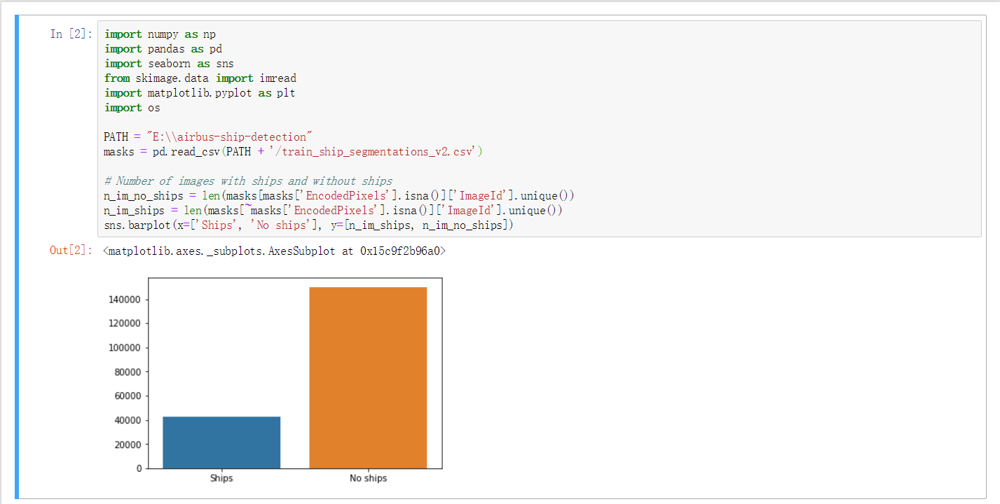
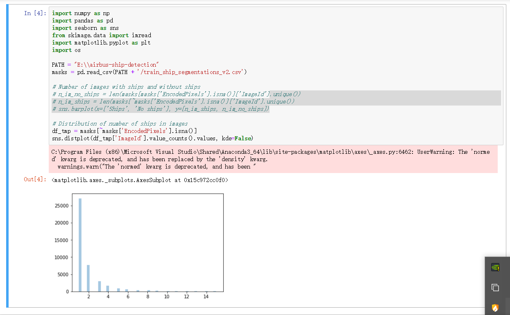
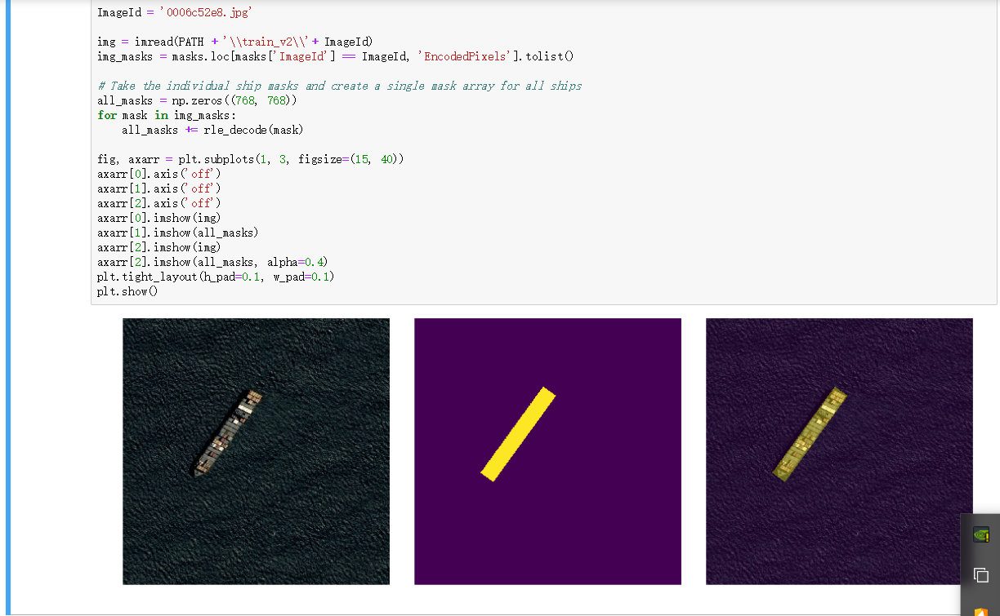

# RLE
created by Lu Yuan, September 2rd, 2019

## Environment
1. Python 3.6
2. Pytorch 1.0, cpu version
3. Jupyter Notebook

## Introduction
RLE全称（run-length encoding），译为游程编码，又称变动长度编码法（run coding），在控制论中对于二值图像而言是一种编码方法，对连续的黑、白像素数(游程)以不同的码字进行编码。

游程编码是一种简单的非破坏性资料压缩法，其好处是加压缩和解压缩都非常快。其方法是计算连续出现的资料长度压缩之。RLE编码是微软开发为AVI格式开发的一种编码，文件扩展名为AVI，使用了RLE压缩算法，这是一种无损的压缩算法，我们常见的tga格式的图像文件就使用了RLE算法。

There are 192556 pictures in train sets in total.
## Usage
1. Distinguish photoes with ships from photoes without ships (in train datasets)

2. Distinguish photoes with different number of ships (in train datasets)

3. Preview of an example (basic visualization)

