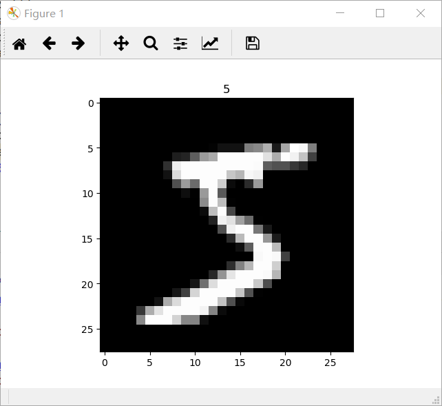
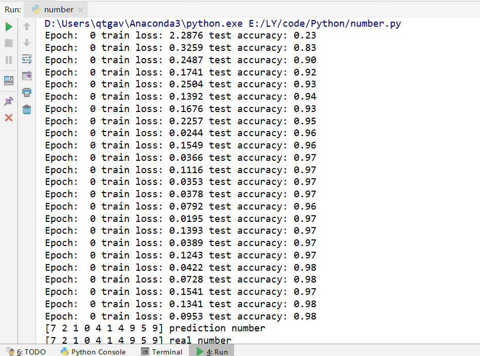

# HandWriting Number Recognition (CNN) by Pytorch
created by Lu Yuan, August 24th, 2019

## Environment
1. Python 3.6
2. Pytorch 1.0, cpu version

## Main Steps
1. Download dataset from MNIST
2. Use matplotlib to show an example 

3. Define class CNN(convolutional neural network), which contains two convolution layers, two pooling layers and fully connected layers (conv1, max pooling1, conv2, max pooling2, and fully connected layer)
4. train

## Net Structure
1. convolution layer 1: filter is 5*5,  padding is 2, stride is 1, output channel is 16, the input picture size is 28*28*1. After this, we will get a 28*28*16 matrix
2. activation function ReLU
3. pooling layer 1: max pooling, filter is 2*2. After this, we will get a 14*14*16 matrix
4. convolution layer 2: output channel is 32, the other is same as convolution layer 1. After this, we will get a 14*14*32 matrix
5. activation function ReLU
6. pooling layer 2: max pooling, filter is 2*2. After this, we will get a 7*7*32 matrix
7. fully connected layer: transform former matrix to a column vector as the input of softmax

## Super parameters
1. epoch (times of training data) is 1, for saving resource
2. mini batch size is 50
3. learning rate is 0.001

## Result 
1. The accuracy arrives 98% finally and the 10 test example are all predicted correctly

