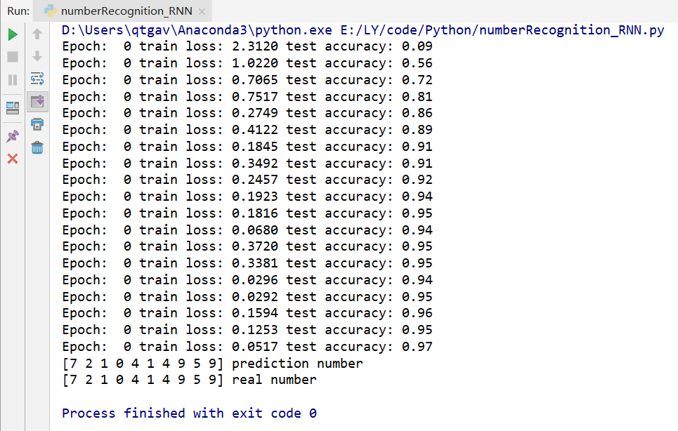

# HandWriting Number Recognition (RNN) by Pytorch
created by Lu Yuan, August 24th, 2019

## Environment
1. Python 3.6
2. Pytorch 1.0, cpu version

## Main Steps
1. Download dataset from MNIST
2. Define class RNN(recurrent neural network), whicn contains a LSTM (Long Short Term Memory) layer
3. train

## Super parameters
1. epoch (times of training data) is 1, for saving resource
2. mini batch size is 64
3. learning rate is 0.01
4. input photo size is 28 * 28

## Result 
1. The accuracy arrives 97% finally and the 10 test example are all predicted correctly

2. CNN do better than RNN in picture recognition