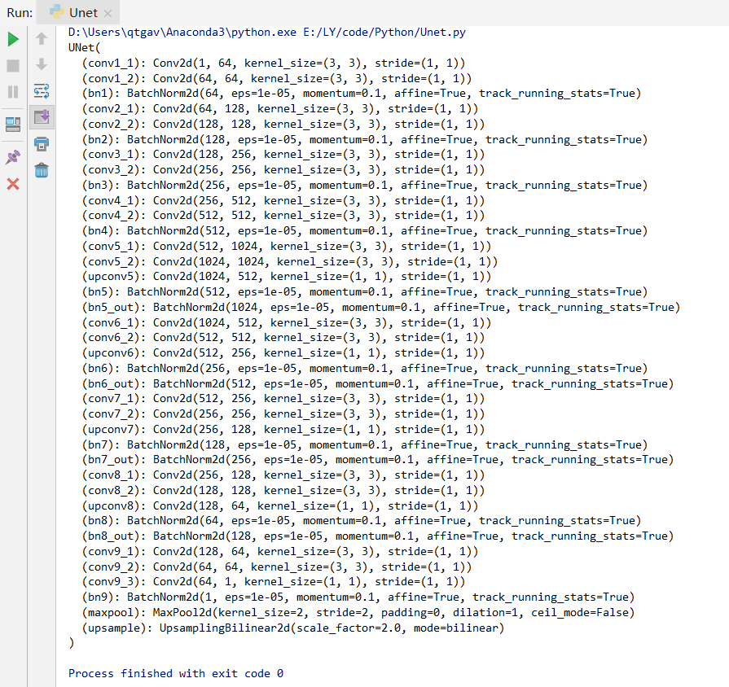

# U-net模型
created by Lu Yuan, September 5th, 2019

## 什么是U-net模型
U-net是一种编码器-解码器结构。编码器逐渐减少池化层的空间维度，解码器逐步修复物体的细节和空间维度。编码器和解码器之间通常存在快捷连接，因此能帮助解码器更好地修复目标的细节。

图1.1：U-net结构

## U-net模型的三个主要特点：undersample，upsample，skip connection
下采样的特征：

进行特征的提取，提取图像的位置、语义等信息

上采样的特征：

上采样的最大的作用其实就是把抽象的特征再还原解码到原图的尺寸，最终得到分割结果

长连接：

U-Net中的长连接是有必要的，它联系了输入图像的很多信息，有助于还原降采样所带来的信息损失

浅层结构可以抓取图像的一些简单的特征，比如边界，颜色，而深层结构因为感受野大了，而且经过的卷积操作多了，能抓取到图像的一些抽象特征。