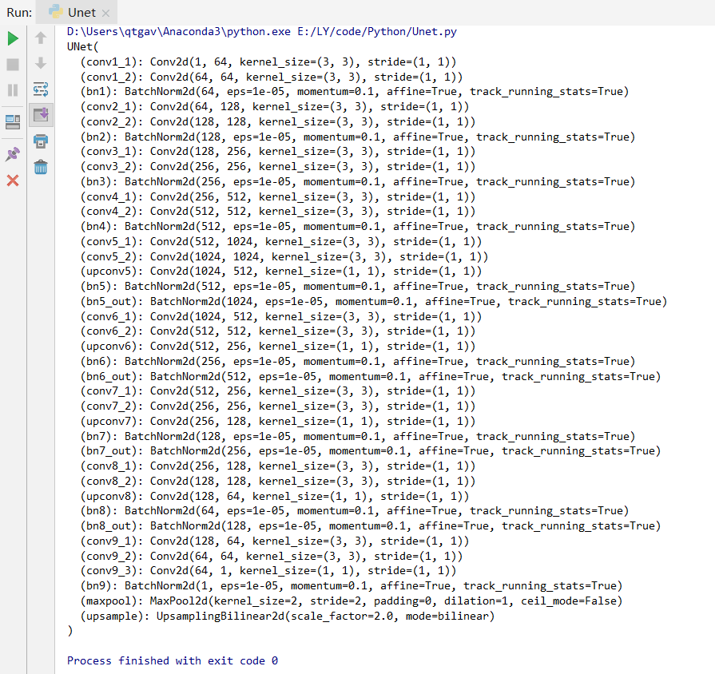

## Unet Model by Pytorch
created by Lu Yuan, September 1st, 2019

## Environment
1. Python 3.6
2. Pytorch 1.0, cpu version

## Net Structure
1. Picuter showed in Unet paper

2. Picture showed by console

3. Using visible tools (from blogs in CSDN)
